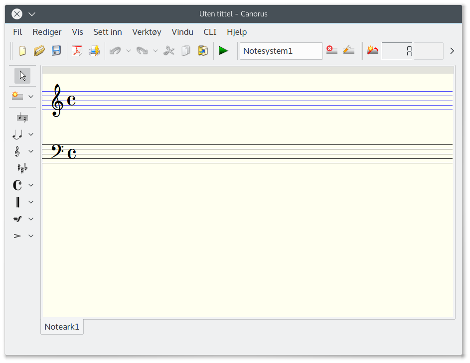
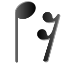

Hurtigstart
===========

Hovedvindu
----------

Det første du møter når du åpner programmet er hovedvinduet. Det ser
omtrent slik ut:

Hovedvinduet består av en meny øverst, vertøylinje for innsetting
av elementer til venstre, generelle innstillinger og musikkinnstillinger
under menylinja øverst og en fanebasert notearkvisning.

Hvert dokument kan ha ett eller flere noteark - et noteark er representert
ved en fane (lignende det du kan finne i skriveprogrammer). Bruk av
flere noteark kan være hensiksmessig for å skille ulike deler av musikkstykket,
ulike transponeringer, variasjoner eller bare som en midlertidig plass
til å skrive ned dine musikalske idéer.

Innsetting av noter
-------------------

For å sette inn noter eller pauser, klikk på notesystemet du vil legge
til et element i, velg stemmen øverst og klikk på ``Noter og pauser``-ikonet
|INSERT_PLAYABLE| i den venstre
verktøylinjen. Den øverste verktøylinjen viser nå note-/pauselengde,
synlighet, noteoppdeling etc.

Klikk deretter med venstre musetast på notesystemet der du vil legge
til en note. For å legge til en pause, klikk med høyre musetast. Hvis
du vil heve/senke en note et halvt notesteg, bruk +/- knappene. For
å endre den innsatte noten, bruk opp/ned-knappene. Klikk . (punktum)
hvis noten skal være punktert.

Innsetting av andre musikkelementer
-----------------------------------

For å sette inn nøkler, toneart, taktart, taktstreker og andre musikkelementer,
bruk knappene i den venstre verktøylinja, bestem egenskapene i vertøylinja
øverst og klikk på notesystemet. Venstre vertøylinje viser hvilke
elementer som kan settes inn i valgt system på notearket. 

For å sette inn en bue, velg først to eller flere noter og klikk på
bueknappen og velg type bue.

En spesiell hurtigtast b setter manuelt inn en taktstrek i angitt
posisjon (f.eks for opptakter).

Redigering av elementer
-----------------------

Hvis du vil endre et musikkelement som allerede er innsatt, må du
gå inn i Redigeringsmodus. Dette gjør du med hurtigtast e eller ved
å klikke den røde pilen i venstre verktøylinje |ARROW|.
Når du velger én eller flere elementer, vises deres egenskaper i den
øverste verktøylinja.

   
Du kan forlate hvilken som helst modus og gå til Valgmodus ved å trykke
Esc-knappen.

Nytt notesystem, stemme, sangtekst
----------------------------------

For å sette inn et nytt system, klikk på ``Sett inn system``-valgknappen
i venstre verktøylinje |STAFF_NEW|,
velg et system (notesystem, sangtekst, funksjonsanalyse) og klikk
på notearket der systemet skal settes inn. 

   
For å sette inn en ny stemme, velg et notesystem på notearket og klikk
på ``Ny stemme``-knappen |VOICE_NEW|.

Avspilling
----------

For å spille av musikken du har skrevet, trykk space-knappen eller
klikk på den grønne avspillingsknappen |PLAY|.
Avspillingen starter fra nåværende eller valgt takt. For å stoppe
avspillingen, klikk på knappen en gang til.

   
Utskrift
--------

Canorus bruker programmet LilyPond for utskrift. 

Desverre følger ikke LilyPond med Canorus. Det første du må gjøre
er å installere LilyPond - gå til http://www.lilypond.org og
last det ned. Du kan også bruke din distribusjons pakkehåndterer for
å installerer det på Linux.

For å bruke utskriftsvisning må du ha en PDF-fremviser installert
på ditt system. Gå til Fil->Utskriftsvisning |PRINT_PREVIEW|.

   
Du kan skrive ut direkte ved å bruke Fil->Skriv ut eller du kan skrive
ut fra din PDF-fremviser (anbefalt).
